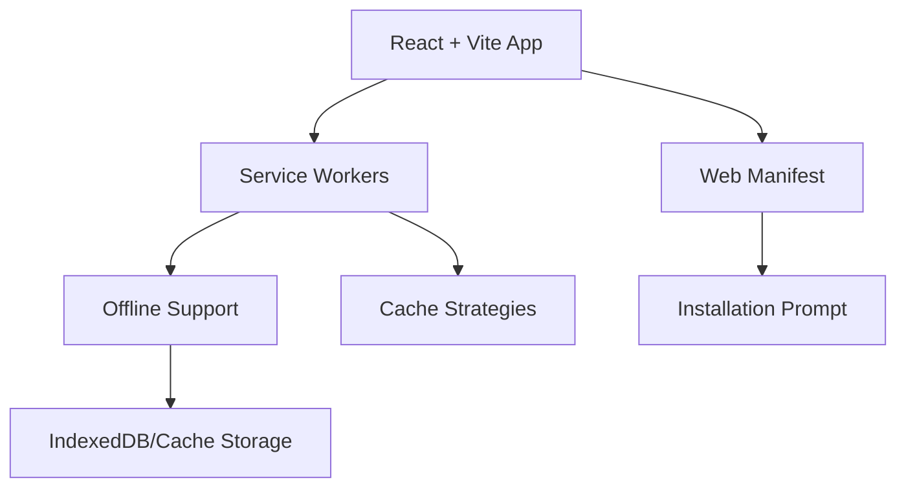
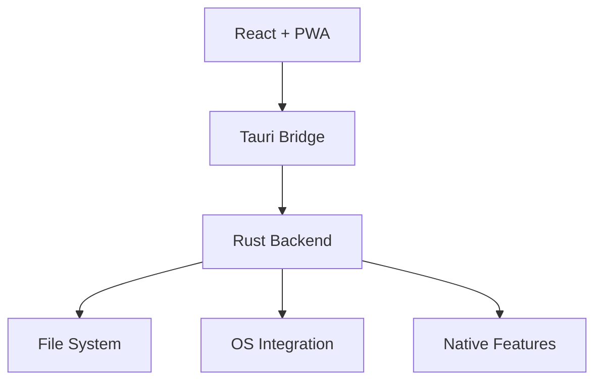
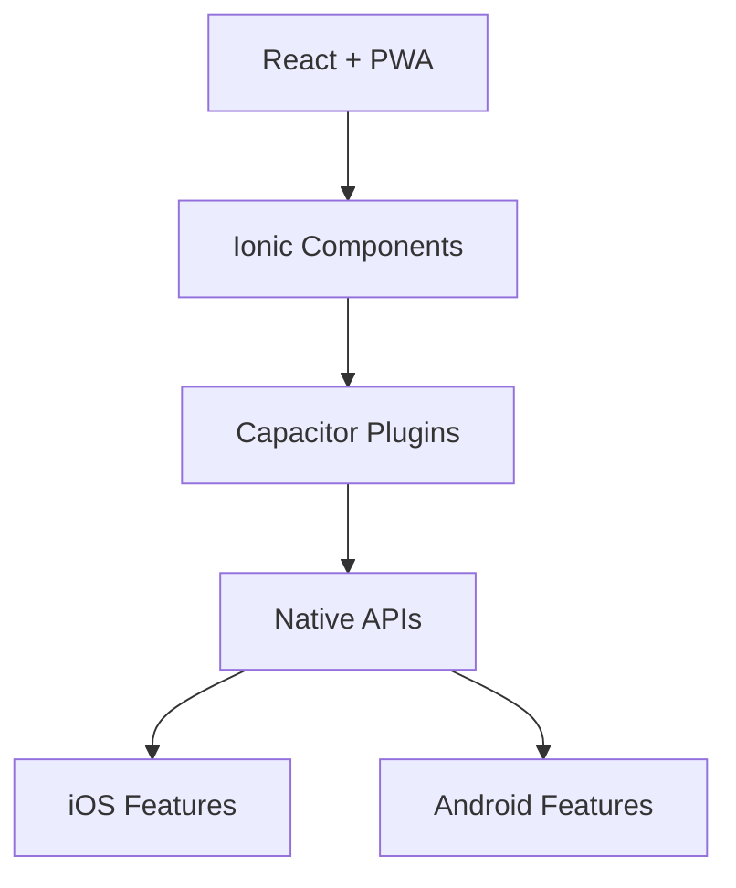

# Cross-Platform Architecture Design

## Context and Requirements

The current application is a React + Vite web application that needs to be accessible across multiple platforms:
- Web browsers (current state)
- Desktop applications
- Mobile devices

## Decision

We will implement a progressive enhancement approach, starting with PWA and adding native capabilities through Tauri and/or Ionic as needed. This approach allows for incremental development while maintaining the existing web functionality.

## Architectural Overview

### Phase 1: Progressive Web App (PWA)



#### Key Components:
1. **Service Workers**
   - Handle offline functionality
   - Manage cache strategies
   - Background sync capabilities

2. **Web Manifest**
   - App metadata
   - Icons and themes
   - Installation parameters

3. **Storage Strategy**
   - IndexedDB for structured data
   - Cache Storage for assets
   - Local Storage for small data

4. **API Modifications**
   - Offline-first approach
   - Queue system for offline operations
   - Background sync when online

### Phase 2: Tauri Integration (Desktop)



#### Key Components:
1. **Tauri Core**
   - Rust-based backend
   - System tray integration
   - Native file system access

2. **IPC Bridge**
   - Command system
   - Event system
   - State management

3. **Security Layer**
   - Permission system
   - Allowlist system
   - CSP configurations

### Phase 3: Ionic Integration (Mobile)



#### Key Components:
1. **Ionic Framework**
   - Mobile UI components
   - Platform-specific styling
   - Gesture handling

2. **Capacitor Core**
   - Native API bridge
   - Plugin system
   - Platform services

## Technical Implementation Details

### 1. PWA Implementation

```typescript
// Service Worker Registration
if ('serviceWorker' in navigator) {
  window.addEventListener('load', () => {
    navigator.serviceWorker.register('/sw.js');
  });
}

// Cache Strategy
const CACHE_NAME = 'app-cache-v1';
const OFFLINE_URLS = [
  '/',
  '/index.html',
  '/offline.html',
  '/manifest.json'
];
```

### 2. Tauri Configuration

```toml
# tauri.conf.json
{
  "build": {
    "distDir": "../dist",
    "devPath": "http://localhost:5173"
  },
  "bundle": {
    "active": true,
    "targets": "all",
    "identifier": "com.deadpool.app",
    "icon": ["icons/32x32.png", "icons/128x128.png"]
  }
}
```

### 3. Ionic Setup

```typescript
// App.tsx
import { IonApp, IonContent } from '@ionic/react';

const App: React.FC = () => (
  <IonApp>
    <IonContent>
      {/* Existing React components */}
    </IonContent>
  </IonApp>
);
```

## Development Workflow

1. **Base Development**
   - Continue developing in React + Vite
   - Implement PWA features
   - Test in browsers

2. **Desktop Building**
   ```bash
   # Development
   npm run tauri dev
   
   # Production
   npm run tauri build
   ```

3. **Mobile Building**
   ```bash
   # iOS
   ionic capacitor build ios
   
   # Android
   ionic capacitor build android
   ```

## Testing Strategy

1. **Web Testing**
   - Unit tests with Vitest
   - E2E tests with Playwright
   - Lighthouse PWA audits

2. **Desktop Testing**
   - Tauri-specific tests
   - OS integration tests
   - Performance benchmarks

3. **Mobile Testing**
   - Device testing
   - Platform-specific tests
   - UI/UX testing

## Deployment Strategy

### Web Deployment
- Continue with current deployment process
- Add PWA assets to build pipeline
- Configure CDN for optimal caching

### Desktop Deployment
- Auto-updates through Tauri
- Platform-specific installers
- Code signing process

### Mobile Deployment
- App store submissions
- Beta testing through TestFlight/Firebase
- OTA updates when possible

## Performance Considerations

1. **Bundle Size**
   - Code splitting
   - Tree shaking
   - Platform-specific chunks

2. **Loading Performance**
   - Asset optimization
   - Lazy loading
   - Preloading critical resources

3. **Runtime Performance**
   - Virtual list for large datasets
   - Efficient re-rendering
   - Memory management

## Security Considerations

1. **Web Security**
   - HTTPS enforcement
   - Content Security Policy
   - CORS configuration

2. **Desktop Security**
   - Tauri's security model
   - File system access controls
   - IPC message validation

3. **Mobile Security**
   - App permissions
   - Data encryption
   - Secure storage

## Migration Path

1. **Initial Setup**
   ```bash
   # PWA Setup
   npm install vite-plugin-pwa
   
   # Tauri Setup
   npm install @tauri-apps/api
   
   # Ionic Setup
   npm install @ionic/react
   ```

2. **Progressive Enhancement**
   - Start with PWA features
   - Add desktop capabilities
   - Implement mobile features

3. **Code Organization**
   ```
   src/
   ├── core/           # Shared business logic
   ├── platform/       # Platform-specific code
   │   ├── web/
   │   ├── desktop/
   │   └── mobile/
   └── components/     # UI components
   ```

## Future Considerations

1. **Feature Parity**
   - Maintain consistent experience
   - Platform-specific enhancements
   - Graceful degradation

2. **Maintenance**
   - Version management
   - Update strategies
   - Bug tracking

3. **Analytics**
   - Platform-specific metrics
   - Usage patterns
   - Performance monitoring

## Resources and Documentation

- [Tauri Documentation](https://tauri.app/docs)
- [PWA Documentation](https://web.dev/progressive-web-apps/)
- [Ionic Documentation](https://ionicframework.com/docs)

## Decision Outcome

This progressive enhancement approach:
- Minimizes initial development overhead
- Provides flexibility in platform support
- Maintains existing web functionality
- Allows for incremental improvements
- Reduces risk through phased implementation

The architecture can be implemented in phases, with each phase building upon the previous one while maintaining functionality throughout the process.